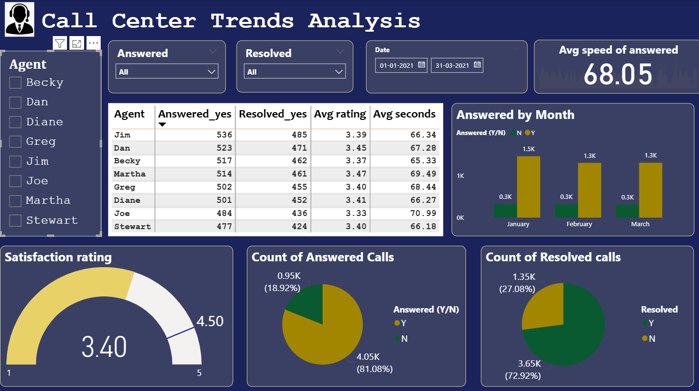

# 📞 Call Center Trend Analysis Dashboard

---

## 📸 Dashboard Screenshot

---

## 📌 Overview
This Power BI dashboard analyzes call center performance by tracking answered calls, resolved calls, and agent efficiency. It helps identify trends and improve customer support operations.

---

## 🚀 Features
- Average Speed of Answered Calls  
- Answered vs Unanswered Calls  
- Resolved Calls Analysis  
- Agent Performance Tracking  

---

## 📊 Visualizations
- **Bar Chart** – Answered and resolved calls by agent  
- **Pie Chart** – Answered vs unanswered calls  
- **Matrix** – Detailed call breakdown by agent and status  

---

## 🎛️ Filters
- Agent Name  
- Answered Calls (Yes/No)  
- Resolved Calls (Yes/No)  
- Date Range  

---

## 📂 Dataset
The dataset contains:
- Agent names  
- Call status  
- Resolved status  
- Call dates  

---

## ⚙️ Requirements
- Power BI Desktop (May 2024 or later)

---

## 🧑‍💻 How to Use
1. Open the `.pbix` file in Power BI  
2. Use slicers to filter the dashboard  
3. Explore call center trends and agent performance  

---

## 💡 Insights
- Compare agent performance  
- Analyze answered vs unanswered calls  
- Track resolution efficiency over time  

---

## 🔮 Future Enhancements
- Add customer satisfaction metrics  
- Add call type analysis  
- Add advanced trend forecasting  

---
